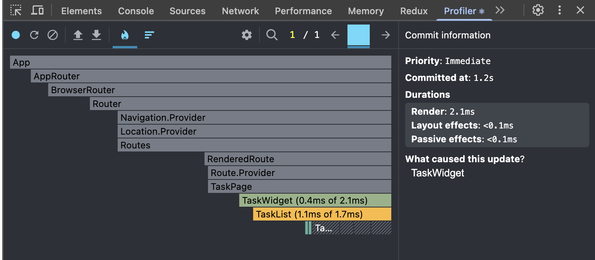

# Мои задачи

Учебный проект курса React: страница со списком задач

Ветка этого этапа: `lesson-2` — оптимизация производительности.

## Технологии

- React 19 + TypeScript
- Vite 8 
- React Router 7
- CSS Modules
- ESLint 9

## Требования

Node.js 22 или выше

## Запуск

```bash
npm ci
npm run dev
```

Приложение будет доступно на `http://localhost:5173`.

## Скрипты

| Команда           | Назначение                                |
| ----------------- | ----------------------------------------- |
| `npm run dev`     | dev-сервер с HMR                          |
| `npm run build`   | проверка типов (`tsc -b`) и продакшен-сборка |
| `npm run lint`    | ESLint                                    |
| `npm run preview` | просмотр собранной версии                 |

## Структура

Проект разложен по [Feature-Sliced Design](https://feature-sliced.design):

```text
src/
├── app/        App, router — маршруты «/» и 404
├── pages/      tasks — страница «Мои задачи», not-found
├── widgets/    task — TaskWidget, связывает состояние со списком
├── features/   taskList — хук useTasks (стейт, фильтр, операции) и TaskList
├── entities/   task — тип Task и презентационный TaskCard
└── shared/     ui/FilterButton
```

Импорты между слайсами — абсолютными путями (`entities/task/ui/TaskCard.tsx`), соответствие слоёв следит правило `boundaries/dependencies` в `eslint.config.js`:

```text
app      → pages, widgets, features, entities, shared
pages    → widgets, features, entities, shared
widgets  → features, entities, shared
features → entities, shared
entities → shared
shared   → (никуда)
```

## Анализ производительности через DevTools



Запишем сессию с удалением карточки.
Строчка справа `What caused this update? TaskWidget` говорит нам, что состояние живёт в
useTasks(), а вызывается этот хук внутри TaskWidget, поэтому React начал
работу с TaskWidget, всё, что выше него, в этот коммит не рендерилось.

На нижней строке 4 серых прямоугольника TaskCard по числу карточек. Серый цвет со штриховкой говорит о том, 
что они не ререндерелись, потому что мемоизированы.

### Задел на будущее

Видно, что после мемоизации карточек узкое место сместилось на TaskList (пересоздание элементов всей длины списка). 
Это нормальное поведение для 5 задач; масштабироваться 
оно начнёт на длинных списках и лечится либо мемоизированной обёрткой списка, либо React Compiler.
